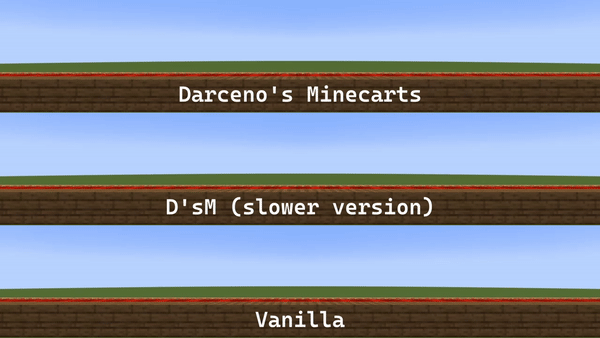
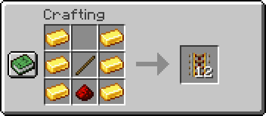

# Darceno's Minecarts

(Previously Vanilla Plus Minecarts)

Connecting your world with bridges and rail systems is really cool, but minecarts are really not. A rail system is one of the most expensive modes of transportation, and also one of the slowest. Imagine a horse going faster than a train?

This data pack (also available  as a mod) aims to improve that while staying within the reasonable limits of vanilla-expected behavior.

# Features
### Speed
When rided with a player or a mob, minecarts move basically as fast as an elytra, making them a viable option for transportation (minecart with chest also moves with increased speed).

And If that's too for you, there's also a slower version with the same features, but half the speed.

### Autonomy
Minecarts can now also go by themselves: both minecart with a mob aboard and minecart with chest will automatically load surrounding chunks if they're on rails, making it possible for them to cross long distances without the need for a player to be near by.

Here's a pig traveling for a thousand blocks all by itself:

(Note that empty minecarts and other minecart's variations are not affected by this in order to keep performance impacts as low as possible - otherwise a lot of farms would be continuously loaded in memory.)

### Affordable rails
The crafting for powered rail now gives you 12 items in return rather than just 6.

## FAQ and Notes
- **Can I include it in my modpack?** Of course. 
- **Is it safe to use?** Yes, and it is also totally interchangeable with vanilla worlds. Adding (or removing) it to an existing world won't cause any problems. The only thing to keep in mind is if you use command blocks with /forceload, as there will be interference with the functions used by this datapack/mod.
- **Does the mod work on multiplayer?** Yes, and as it is originally a datapack, it is 100% serverside, so the client doesn't need to have it installed.
- **Why was the name changed?** CurseForge wouldn't accept it as "Vanilla Plus Minecarts", and it was a very generic name anyways.
- Also remember that if you leave a minecart with a chest/minecart with a mob on top of a rail, even if it's stationary, its chunk will still be loaded. If done excessively, this can cause lag, so it's better to avoid leaving them around carelessly.